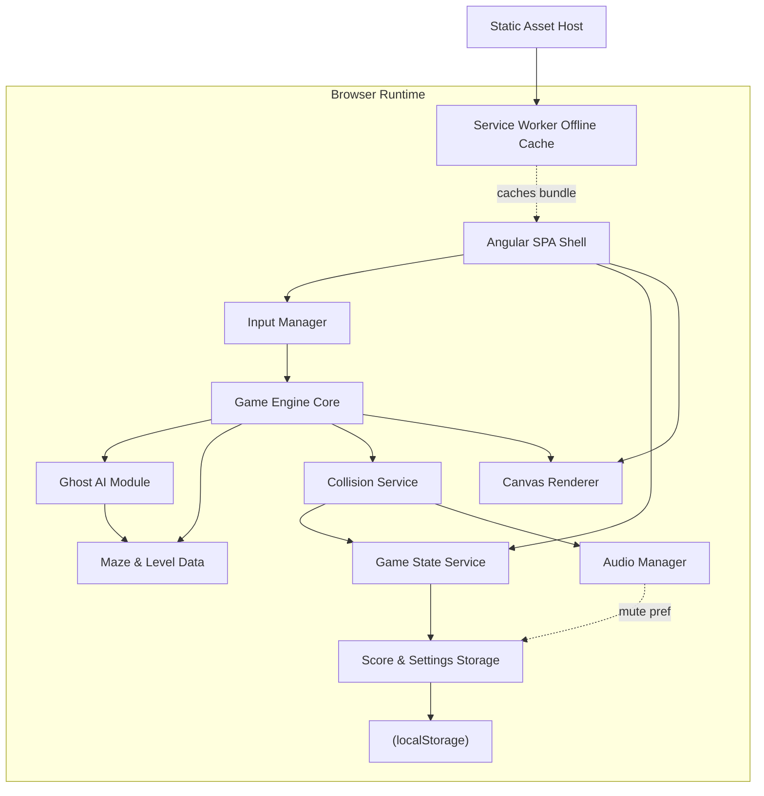

# Architect Mission Report

**Agent**: architect  
**Generated**: 2026-10-04T14:46:15.460Z

---

## Architecture Style

client-only single-page application (modular monolith, no backend)

## Components

- **Angular SPA Shell** (ui): Root Angular application that hosts all screens (start, countdown, gameplay, pause, level-complete, game-over) and switches between them based on game state. Handles layout, responsive scaling, and accessibility (focus management, keyboard navigation).
- **Game Engine Core** (service): Owns the fixed-timestep game loop (requestAnimationFrame), advances Pac-Man and ghost positions each tick, triggers collision checks, manages level/scared/scatter-chase timers, and emits state changes to the UI.
- **Maze & Level Data** (module): Static maze tile grid (walls, corridors, dots, power pellets, tunnel, ghost house), plus per-level difficulty configuration (ghost speed, scared duration, scatter/chase ratios, fruit type/points) for 20+ levels.
- **Ghost AI Module** (service): Implements the four distinct ghost targeting algorithms (direct chase, ambush-ahead, flank/pincer, chase-or-random wildcard) plus scatter-mode corner targeting and scared-mode reversal/fleeing behavior.
- **Collision Service** (service): Detects dot/pellet consumption, Pac-Man/ghost collisions (death vs. eat-ghost), tunnel wraparound, and fruit pickup; raises scoring and audio trigger events.
- **Input Manager** (service): Normalizes keyboard (arrow keys/WASD), touch swipe, and on-screen directional button input into a single direction stream consumed by the game engine.
- **Audio Manager** (service): Plays all sound effects (dot-eat, pellet, ghost-eat, death, fruit, extra-life, startup jingle) and the looping background siren with dynamic pitch tied to remaining dots; supports global mute.
- **Canvas Renderer** (ui): Draws the maze, Pac-Man (with chomp animation), ghosts (with color/scared/eyes states), dots, pellets, fruit, and HUD overlays onto an HTML5 canvas at 60fps.
- **Score & Settings Storage** (service): Wraps browser localStorage to persist the top-10 high score list (with initials), all-time high score, mute preference, and colorblind-mode preference across sessions.
- **Game State Service** (service): Central state machine (start -> countdown -> playing -> paused -> level-complete -> game-over) plus score, lives, and level counters exposed as observables to the UI.
- **Service Worker / Offline Cache** (infra): Pre-caches the built app shell, assets, and audio so the game is fully playable offline after first load, keeping total payload under 2MB.
- **Static Asset Host** (infra): Serves the compiled static Angular bundle (HTML/CSS/JS/assets); no server-side logic required.

## Tech Stack

- **frontend**: Angular 17 (standalone components) + TypeScript — Explicitly requested by stakeholder. Angular's built-in DI, RxJS integration, and CLI tooling (build, dev-server, budgets, service worker) give a batteries-included setup ideal for a single, self-contained client app without needing extra libraries for routing/state/build that React or Vue would require.
- **rendering**: HTML5 Canvas 2D API — Canvas gives direct pixel-level control and the best performance for a tile-based arcade game redrawing dozens of moving sprites at 60fps; SVG/DOM approaches incur layout/reflow overhead at this entity count and frame rate.
- **state management**: Angular services with RxJS BehaviorSubjects — The app has a single player, single game session, and a handful of state slices (score, lives, level, screen). NgRx/Akita add significant boilerplate and bundle size for no benefit here; plain injectable services with RxJS streams keep the bundle small (important for the <2MB budget) while remaining fully testable.
- **database**: None — browser localStorage — Stakeholder explicitly requires no database/backend; all persisted data (top-10 high scores, mute/colorblind settings) is small, synchronous key-value data well suited to localStorage. IndexedDB would add unnecessary async complexity for this tiny dataset.
- **audio**: Web Audio API — Web Audio API natively supports the dynamic siren pitch-shifting requirement (playbackRate/detune) and precise low-latency sound triggering needed for dot-eating cadence. Howler.js is a fine alternative but adds an extra dependency for capabilities the native API already provides; plain <audio> elements can't easily do real-time pitch changes.
- **offline/PWA**: @angular/service-worker — Ships integrated with Angular CLI (ngsw-config.json), requiring minimal setup to precache the app shell and assets and satisfy the offline-play requirement; manual Workbox config would duplicate what the CLI already automates.
- **infra**: Static file hosting (CDN/static host, no server) — The app has no backend logic or database, so a static host is the simplest, cheapest, and most scalable option; a Node server or orchestrator would be pure overhead for a client-only game, violating proportionality.
- **auth**: None — no user accounts — Single-player local game with no multiplayer, profiles, or server-side data; only a 3-letter initials entry stored locally. Introducing auth would add complexity with no corresponding requirement.
- **messaging**: None — in-process RxJS event streams only — No multiplayer or cross-client communication is required; all events (input, collisions, scoring) happen within a single browser tab, so in-memory RxJS observables fully suffice.
- **testing**: Angular CLI default (Jasmine + Karma, headless Chrome) — Per stakeholder, extensive TDD/test suites are out of scope; Jasmine/Karma ships pre-wired with Angular CLI (`ng test`) with zero extra configuration, giving a real, runnable test command for basic smoke/unit coverage without investing in a separate test framework or E2E stack.
- **CI/CD**: None — manual local build & deploy — Stakeholder explicitly excluded CI/CD and Jenkins; `npm run build` produces a static bundle that can be manually copied to any static host, which is sufficient for this project's scope.
- **build tool**: Angular CLI (esbuild-based builder) — Comes bundled with Angular, includes bundle-size budgets (enforcing the <2MB target) and the service worker build step out of the box, avoiding duplicated tooling effort that a separate bundler like Vite would require for an Angular project.

## Epics

- **EPIC-001** Maze Rendering & Core Loop: Build the maze tile model (walls, corridors, dots, power pellets, tunnel, ghost house), the canvas renderer, and the fixed-timestep game loop that drives all entity updates at 60fps.
- **EPIC-002** Pac-Man Movement & Input: Implement Pac-Man's continuous movement, wall-stopping, chomp animation, directional facing, and unified keyboard/swipe/on-screen-button input handling.
- **EPIC-003** Ghost Behaviors & AI: Implement the four distinct ghost personalities (direct chase, ambush, flank, wildcard), the chase/scatter timer alternation, and ghost-house release sequencing.
- **EPIC-004** Power Pellets & Scared/Eaten Ghost Mechanics: Implement power pellet consumption, the scared/vulnerable ghost state with color change, reversal, slow-down, end-of-state flashing, eyes-returning-to-house behavior, and escalating 200/400/800/1600 eat scoring.
- **EPIC-005** Scoring, Lives & Extra Life: Track dot/pellet/ghost/fruit scoring, lives countdown on death with brief death animation and level reset, and award an extra life at 10,000 points.
- **EPIC-006** Bonus Fruit: Spawn level-specific bonus fruit near the ghost house after ~70 and ~170 dots eaten, with per-level fruit type/points and auto-disappear timeout.
- **EPIC-007** Level Progression & Difficulty Scaling: Detect level completion, advance through 20+ levels with increasing ghost speed, shorter scared duration, and more chase-heavy timers, repeating hardest settings thereafter.
- **EPIC-008** Game Flow Screens: Build start screen, 3-2-1-GO countdown, pause overlay, level-complete transition, and game-over screen (with high-score initials entry) and the state machine wiring them together.
- **EPIC-009** Audio System: Implement startup jingle, dot/pellet/ghost-eat/death/fruit/extra-life sound effects, the looping background siren with level-based pitch changes, and a global mute toggle.
- **EPIC-010** High Score Persistence: Maintain a persistent top-10 high score list and all-time high score display, saved to and loaded from localStorage across sessions.
- **EPIC-011** Accessibility & Colorblind Mode: Ensure full keyboard operability of all menus/screens with visible focus indicators, and add a colorblind-friendly ghost color palette toggle.
- **EPIC-012** Responsive & Mobile Controls: Deliver swipe gestures and on-screen directional buttons for touch devices, plus responsive layout scaling from 375px to 2560px.
- **EPIC-013** Offline Support & Bundle Budget: Configure the Angular service worker to precache the app shell and assets for offline play, and enforce bundle-size budgets to keep total payload under 2MB.

## Architecture Diagram

