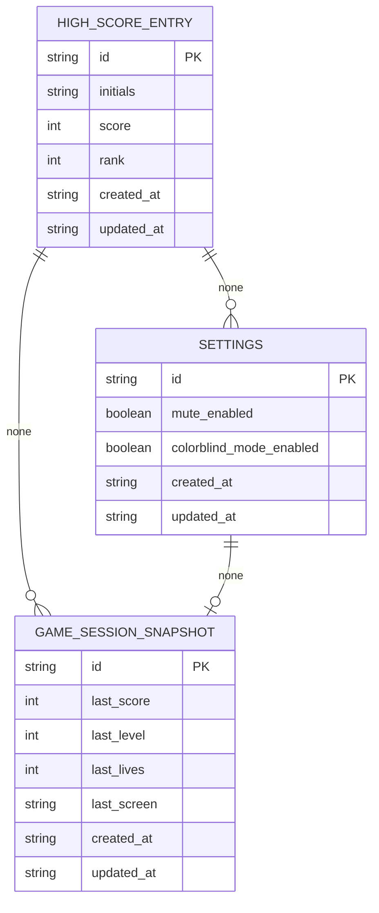

# DBA Mission Report

**Agent**: dba  
**Generated**: 2026-10-04T14:50:03.886Z

---

## Database Engine: None (browser localStorage only)

The architecture and tech stack explicitly specify a client-only Angular SPA with no backend and no database. Persistent data is limited to small, synchronous browser localStorage values (top-10 high scores, mute preference, colorblind mode). Therefore, there is no database engine to design or migrate. The appropriate persistence mechanism is localStorage, not a relational or NoSQL database.

## Entities (3)

- **high_score_entry**: 6 columns
- **settings**: 5 columns
- **game_session_snapshot**: 7 columns

## ERD

