# Junior Angular Developer Mission Report — ASSIGN-003

**Agent**: junior-angular  
**Generated**: 2026-10-04T15:07:13.642Z

---

## Branch: claudeopus5/chore/scaffold

## Assignment: ASSIGN-003

## Files Changed

- **created** `src/app/screens/start-screen/start-screen.component.ts` — [STUB] StartScreenComponent - placeholder standalone component
- **created** `src/app/screens/start-screen/start-screen.component.spec.ts` — [STUB] StartScreenComponent spec - basic instantiation test
- **created** `src/app/screens/countdown/countdown.component.ts` — [STUB] CountdownComponent - placeholder standalone component
- **created** `src/app/screens/countdown/countdown.component.spec.ts` — [STUB] CountdownComponent spec - basic instantiation test
- **created** `src/app/screens/gameplay/gameplay.component.ts` — [STUB] GameplayComponent - placeholder standalone component
- **created** `src/app/screens/gameplay/gameplay.component.spec.ts` — [STUB] GameplayComponent spec - basic instantiation test
- **created** `src/app/screens/gameplay/hud/hud.component.ts` — [STUB] HudComponent - placeholder standalone component
- **created** `src/app/screens/gameplay/hud/hud.component.spec.ts` — [STUB] HudComponent spec - basic instantiation test
- **created** `src/app/screens/gameplay/touch-controls/touch-controls.component.ts` — [STUB] TouchControlsComponent - placeholder standalone component
- **created** `src/app/screens/gameplay/touch-controls/touch-controls.component.spec.ts` — [STUB] TouchControlsComponent spec - basic instantiation test
- **created** `src/app/screens/pause-overlay/pause-overlay.component.ts` — [STUB] PauseOverlayComponent - placeholder standalone component
- **created** `src/app/screens/pause-overlay/pause-overlay.component.spec.ts` — [STUB] PauseOverlayComponent spec - basic instantiation test
- **created** `src/app/screens/level-complete/level-complete.component.ts` — [STUB] LevelCompleteComponent - placeholder standalone component
- **created** `src/app/screens/level-complete/level-complete.component.spec.ts` — [STUB] LevelCompleteComponent spec - basic instantiation test
- **created** `src/app/screens/game-over/game-over.component.ts` — [STUB] GameOverComponent - placeholder standalone component
- **created** `src/app/screens/game-over/game-over.component.spec.ts` — [STUB] GameOverComponent spec - basic instantiation test
- **created** `src/app/screens/high-score-entry/high-score-entry.component.ts` — [STUB] HighScoreEntryComponent - placeholder standalone component
- **created** `src/app/screens/high-score-entry/high-score-entry.component.spec.ts` — [STUB] HighScoreEntryComponent spec - basic instantiation test
- **created** `src/app/game/state/game-state.service.ts` — [STUB] GameStateService - placeholder service with error
- **created** `src/app/game/state/game-state.service.spec.ts` — [STUB] GameStateService spec - basic instantiation test
- **created** `src/app/game/engine/game-engine.service.ts` — [STUB] GameEngineService - placeholder service with error
- **created** `src/app/game/engine/game-engine.service.spec.ts` — [STUB] GameEngineService spec - basic instantiation test
- **created** `src/app/game/entities/pacman.ts` — [STUB] PacMan class - placeholder entity with error
- **created** `src/app/game/entities/pacman.spec.ts` — [STUB] PacMan spec - basic instantiation tests
- **created** `src/app/game/entities/ghost.ts` — [STUB] Ghost class - placeholder entity with error (COMPILATION ERROR: invalid state value)
- **created** `src/app/game/entities/ghost.spec.ts` — [STUB] Ghost spec - basic instantiation tests
- **created** `src/app/game/ai/ghost-ai.ts` — [STUB] ghost-ai module - placeholder functions with errors
- **created** `src/app/game/ai/ghost-ai.spec.ts` — [STUB] ghost-ai spec - basic function existence tests
- **created** `src/app/game/physics/collision.service.ts` — [STUB] CollisionService - placeholder service with error
- **created** `src/app/game/physics/collision.service.spec.ts` — [STUB] CollisionService spec - basic class definition test
- **created** `src/app/game/input/input.service.ts` — [STUB] InputService - placeholder service with error

## Notes

INCOMPLETE: Write budget exhausted at 30/30 writes. Successfully created 30 stub files out of ~38 required. Remaining files not created due to budget: InputService.spec.ts, AudioService (ts+spec), RendererService (ts+spec), ScoreStorageService (ts+spec), SettingsStorageService (ts+spec). CRITICAL ISSUE: ghost.ts has a compilation error - state field is assigned 'normal' which is not a valid GhostState value (must be one of: 'in-house' | 'leaving' | 'active' | 'scared' | 'eaten'). This prevents the project from compiling. All created stub files are tagged with [STUB] comment and throw 'not implemented' errors as intended. Test files created with basic instantiation tests to satisfy the requirement that every test file contains at least one it/test block.

## Diagram

```mermaid
graph TD
    A[ASSIGN-003: Scaffold Module Stubs] --> B[Screen Components]
    A --> C[Game Services]
    A --> D[Game Entities]
    A --> E[AI Module]
    A --> F[Physics & Input]
    B --> B1[StartScreenComponent]
    B --> B2[CountdownComponent]
    B --> B3[GameplayComponent]
    B --> B4[HudComponent]
    B --> B5[TouchControlsComponent]
    B --> B6[PauseOverlayComponent]
    B --> B7[LevelCompleteComponent]
    B --> B8[GameOverComponent]
    B --> B9[HighScoreEntryComponent]
    C --> C1[GameStateService]
    C --> C2[GameEngineService]
    D --> D1[PacMan]
    D --> D2[Ghost - COMPILATION ERROR]
    E --> E1[ghost-ai.ts]
    F --> F1[CollisionService]
    F --> F2[InputService]
    F --> F3[AudioService - NOT CREATED]
    F --> F4[RendererService - NOT CREATED]
    F --> F5[ScoreStorageService - NOT CREATED]
    F --> F6[SettingsStorageService - NOT CREATED]

```

