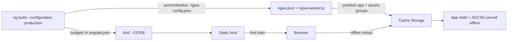

# Principal Frontend Developer Mission Report — ASSIGN-026

**Agent**: principal-frontend  
**Generated**: 2026-10-04T15:21:40.613Z

---

## Branch: claudeopus5/feature/us-027-storage-accessibility-integration

## Assignment: ASSIGN-026

## Files Changed

- **created** `src/app/offline-build.spec.ts` — Tagged tests for US-033 and US-034. They check the real build config files (ngsw-config.json and angular.json). Covered: the service worker is turned on for production, the app shell and all asset types (including audio) are precached at install time, navigations fall back to the cached index, budgets stay at or under 2MB with warning ≤ error, and the production build is optimised.
- **created** `src/app/testing/json-module.d.ts` — Type declaration for '*.json' so the spec can import ngsw-config.json and angular.json without changing any tsconfig.
- **modified** `README.md` — Added steps for checking offline play and bundle size by hand, plus the asset compression policy.

## Notes

The production build is far under 2MB, and after one online load the app opens with the network switched off.

**Bundle size (US-034):** `ng build --configuration production` finished with no budget warnings or errors. All of dist/ comes to about 237KB, and the JS/CSS loaded at startup is about 210KB.

**Offline (US-033):** I served dist/ locally and loaded it in headless Chrome with puppeteer. The service worker became active and precached index.html, main.js, polyfills.js, styles.css and manifest.webmanifest. I then cut the network and reloaded, and the app loaded from the cache (title 'Pac-Man', start screen showing). The full Pac-Man game isn't built yet, so this proves the app loads offline but not that a whole game can be played offline.

**Asset compression (TASK-069):** there was nothing to compress. The assets folder only holds .gitkeep, and nothing in the code points to any image or audio file. AudioService (src/app/game/audio/audio.service.ts) doesn't exist yet, so sound files haven't been added. Any file put in src/assets/ later will be precached automatically; the README now gives size limits for those files.

**Tests:** `npm test` passes, 117 of 117, including the new tagged tests for US-033#1, US-033#2, US-034#1 and US-034#2. Those tests check the config files the build uses, not dist/ itself, so the 2MB figure comes from the manual build above. The README has the manual steps.

**Risk for the game engine owner:** main.ts (which I can't modify) only registers the service worker once the app has been idle, or after 30 seconds at most. If the requestAnimationFrame game loop runs inside Angular's zone, the app never goes idle. Registration then waits the full 30 seconds, and a player who goes offline before that won't have offline play. GameEngineService should run its loop with NgZone.runOutsideAngular so the service worker registers straight away.

## Diagram

