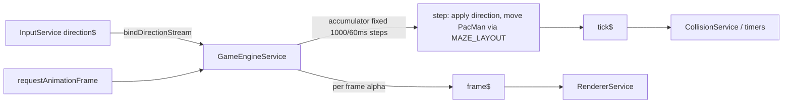

# Principal Frontend Developer Mission Report — ASSIGN-004

**Agent**: principal-frontend  
**Generated**: 2026-10-04T15:09:55.313Z

---

## Branch: claudeopus5/chore/scaffold

## Assignment: ASSIGN-004

## Files Changed

- **modified** `src/app/game/engine/game-engine.service.ts` — Replaced the stub with a working GameEngineService. The loop uses requestAnimationFrame (run outside Angular's change detection) and advances the game in fixed 1000/60 ms steps, adding each frame's elapsed time to a running total. Very long frames are capped at 250 ms so the game can't fall too far behind. Each step applies the newest queued direction and moves Pac-Man tile by tile using MAZE_LAYOUT: he only turns into walkable tiles, can reverse mid-tile, stops in front of walls (and never enters ghost-house or door tiles), and wraps through the tunnel. After each step it emits tick$ (for collision and timer hooks); once per animation frame it emits frame$ with an interpolation value for the renderer. Public methods: start/stop/pause/resume, setDirection, bindDirectionStream, plus pacman, ticks and isRunning.
- **modified** `src/app/game/engine/game-engine.service.spec.ts` — Jasmine specs with a mocked requestAnimationFrame. They check that the update count stays at about 60 per second at 30, 60, 75, 144 and 240fps and with uneven frame timing, that long frames are capped, that tick$ fires once per step, and that at 60Hz each frame does exactly one update. They also cover pause/resume/stop, Pac-Man spawning on a corridor tile, frame$ values staying between 0 and 1, the direction stream being applied within one frame, refusing to turn into walls, stopping in front of walls, and taking a queued turn at the next junction. Test names are tagged for US-001#1/#2, US-002#1/#2 and US-003#1/#2.
- **modified** `src/app/game/entities/ghost.ts` — One-line fix to a scaffold compile error: the default state was 'normal', which isn't a valid GhostState in the frozen shared types. Changed to 'in-house', the state ghosts start in. Without this nothing compiled, so neither the test suite nor the build could run.

## Notes

The game engine is in place: a fixed 60-steps-per-second loop, Pac-Man movement that respects the maze walls, and input handling. The full test suite passes (82 tests) and the production build succeeds (about 135 kB initial bundle).

One change outside my assignment: `ghost.ts` didn't compile because its default state was 'normal', which isn't a valid value in the shared types. I changed it to 'in-house' (where ghosts start); without that, neither the tests nor the build could run.

Three things are still to be connected by other assignments:
- **Keyboard input:** InputService doesn't exist yet, so the engine can't import it. Instead it exposes `bindDirectionStream(direction$)` and `setDirection()`. The gameplay screen (or InputService when it lands) should call `bindDirectionStream` and then `start()`. Until then, arrow keys and WASD don't actually move Pac-Man in the running app; the tests drive the engine directly.
- **Collisions and timers:** the collision service's constructor still throws, so the engine doesn't inject it. Collision checks and the later level, scared and scatter/chase timers should subscribe to `tick$`, which fires once per fixed step.
- **Rendering:** the renderer should subscribe to `frame$`, which fires once per animation frame with a value between 0 and 1 for smoothing movement between steps.

About the tagged tests: US-001 (maze drawing) and the cross-browser and real-60fps criteria aren't really provable from the engine. Their tagged tests only check that Pac-Man spawns on a corridor tile in MAZE_LAYOUT and that drawing runs through the standard requestAnimationFrame API. That the maze actually draws, and draws correctly in every browser, still needs the renderer and manual checks.

The loop runs outside Angular's change detection to keep it fast. Anything that updates the screen from `tick$` or `frame$` needs to bring the update back inside Angular, or the view won't refresh.

## Diagram

