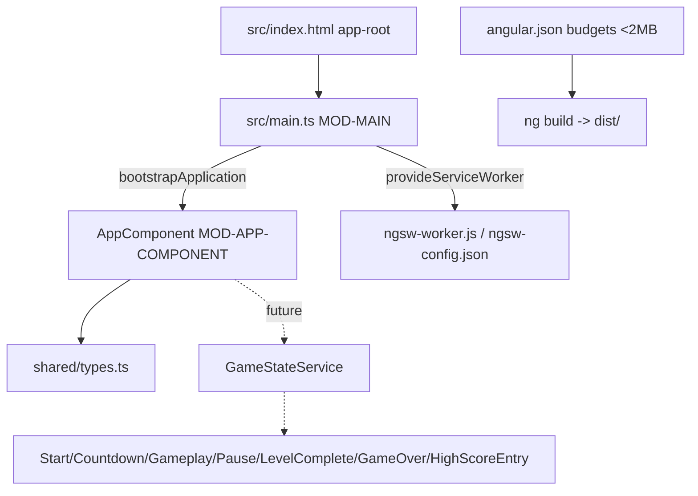

# Principal Frontend Developer Mission Report — ASSIGN-001

**Agent**: principal-frontend  
**Generated**: 2026-10-04T14:58:27.878Z

---

## Branch: claudeopus5/chore/scaffold

## Assignment: ASSIGN-001

## Files Changed

- **created** `package.json` — Angular 17 dependencies plus the start, build and test scripts named in the repo contract. Puppeteer is included so headless tests have a Chrome to run.
- **created** `angular.json` — esbuild application builder with standalone components. Production build has bundle budgets (initial: 1MB warning, 2MB error) and the service worker turned on. Karma is set up for tests.
- **created** `tsconfig.json` — Strict TypeScript settings and strict Angular template checks.
- **created** `tsconfig.app.json` — App build TypeScript config, entry point src/main.ts.
- **created** `tsconfig.spec.json` — TypeScript config for the Jasmine spec files.
- **created** `karma.conf.js` — Karma config that uses Puppeteer's Chrome and defines a no-sandbox 'ChromeHeadless' launcher, so the contract test command runs in a container.
- **created** `ngsw-config.json` — Service worker config that pre-caches the app files and assets (including audio) for offline play.
- **created** `src/index.html` — HTML page with viewport, theme-color, manifest link and the <app-root> host element.
- **created** `src/manifest.webmanifest` — Web app manifest for installing the game as a PWA.
- **created** `src/styles.css` — Global colour and font variables, a base reset, a visible :focus-visible outline and reduced-motion support.
- **created** `src/assets/.gitkeep` — Keeps the empty assets folder in git so the build finds it.
- **created** `src/main.ts` — MOD-MAIN (frozen): starts AppComponent with provideServiceWorker (production only) and exports the startup promise as default. No router, because screens are switched by game state.
- **created** `src/app/shared/types.ts` — MOD-SHARED-TYPES (frozen): Direction, Tile, GhostName, GhostState, Mode, GameScreen, HighScoreEntry, Fruit, GhostCollisionResult.
- **created** `src/app/app.component.ts` — MOD-APP-COMPONENT placeholder: standalone root component using OnPush, showing the current GameScreen. The assignment that owns it will connect the screens and GameStateService.
- **created** `src/app/app.component.spec.ts` — Tests tagged [US-035#1] and [US-035#2]: the shell starts on the start screen and is created without extra providers.

## Notes

The project builds and its tests pass. `npm run build` produces an initial bundle of 135 kB raw (about 42 kB transferred), well under the 2MB limit. `npm test` runs 2 tests in headless Chrome and both pass.

Things the other assignments need to know:
- **Frozen files:** `src/main.ts`, `angular.json` and `src/app/shared/types.ts` must not be edited from now on.
- **No router:** `main.ts` doesn't set one up. `AppComponent` should pick which screen to show based on `GameStateService`'s `GameScreen` value.
- **Bundle size:** to keep it small, load non-critical screens (game-over, high-score entry, level-complete) with `@defer` blocks.
- **App shell:** `AppComponent` is still a placeholder. Its owner should replace its body with the real screen switching.
- **Root-level services:** services should use `@Injectable({providedIn: 'root'})`. This works because `main.ts` only registers the service worker.
- **Test browser:** there's no system Chrome in this environment, so `karma.conf.js` points `CHROME_BIN` at Puppeteer's Chrome and redefines the `ChromeHeadless` launcher with `--no-sandbox`.
- **Leftover dependency:** `@angular/platform-browser-dynamic` is only needed for tests but sits in `dependencies`. It doesn't increase the production bundle.
- **Node warning:** the CLI warns about Node v25 because it is an odd-numbered release, but it works.

TASK-068 (bundle-size optimisation) is only partly done here: the budgets are enforced and the bundle starts small, but the screens to lazy-load don't exist yet.

## Diagram

