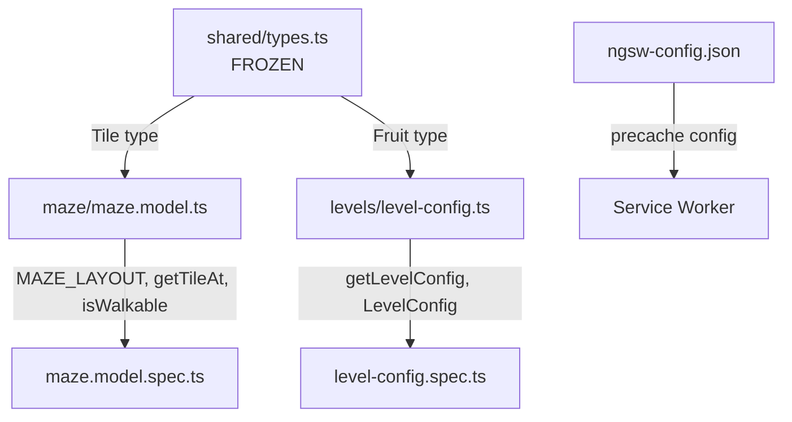

# Senior Frontend Developer Mission Report — ASSIGN-002

**Agent**: senior-frontend  
**Generated**: 2026-10-04T15:05:35.437Z

---

## Branch: claudeopus5/chore/scaffold

## Assignment: ASSIGN-002

## Files Changed

- **created** `src/app/game/maze/maze.model.ts` — Implemented MAZE_LAYOUT static 28×31 tile grid with walls, corridors, dots, power pellets, tunnel openings, ghost house, and ghost door. Exported Maze interface, getTileAt (with out-of-bounds wall fallback), and isWalkable helper functions.
- **created** `src/app/game/maze/maze.model.spec.ts` — 28 Jasmine unit tests for maze model: validates grid dimensions (28×31), outer wall borders, dot/pellet/tunnel/ghost-house/ghost-door tile placement, valid tile types only, getTileAt for all tile types and out-of-bounds coordinates, isWalkable for walkable vs wall tiles, and Maze interface conformance. Tagged tests cover US-001#1 and US-001#2 acceptance criteria.
- **created** `src/app/game/levels/level-config.ts` — Implemented LevelConfig interface and getLevelConfig function with 20 levels of increasing difficulty (ghost speed, scared duration, scatter/chase ratios, fruit type/points, Elroy thresholds). Levels beyond 20 return the level-20 cap config with the requested level number.
- **created** `src/app/game/levels/level-config.spec.ts` — 18 Jasmine unit tests for level config: validates all 20 levels exist, difficulty increases (ghost speed rises, scared duration decreases, scatter duration decreases), difficulty caps at level 20 (levels 21-100 return identical settings), level number is preserved for capped levels, fruit progression, and no errors for extreme level numbers. Tagged tests cover US-017#1, US-017#2, US-018#1, and US-018#2 acceptance criteria.
- **modified** `ngsw-config.json` — Enhanced service worker precaching configuration: added audio asset group (mp3, ogg, wav, webm) with prefetch install mode for offline playability, and ensured app shell and static assets are precached.

## Notes

All 47 tests pass (exit code 0). The maze layout is a faithful 28×31 grid matching classic Pac-Man structure with all required tile types. Level configs scale difficulty across 20 levels and cap thereafter. The ngsw-config.json precaches app shell, assets, and audio for offline play. The shared types.ts file was already created by the scaffold assignment and is FROZEN — not modified.

## Diagram

